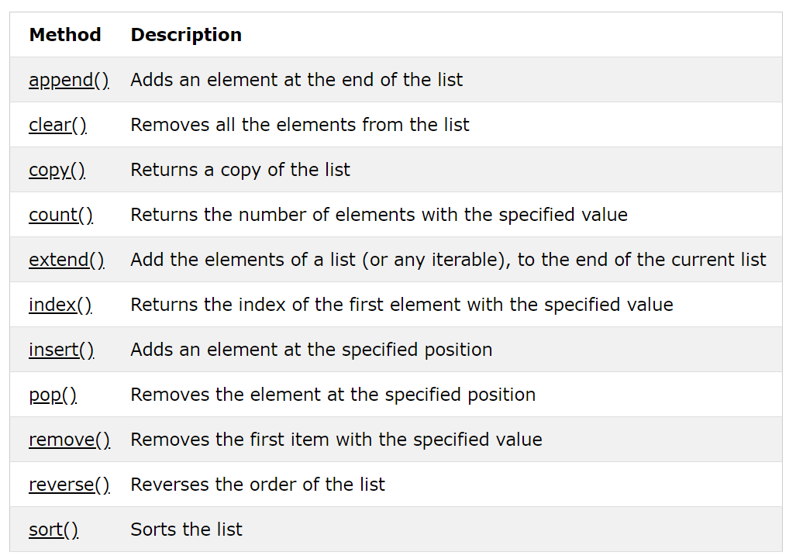

<!--

---
jupyter:
  jupytext:
    hide_notebook_metadata: true
    text_representation:
      extension: .md
      format_name: markdown
      format_version: '1.3'
      jupytext_version: 1.11.2
  kernelspec:
    display_name: Python 3
    language: python
    name: python3
---

-->

## Python Lists, Tuples & Dictionaries
#### PCEP Exam block #4: Data Collections


## Lists

#### What's the intended purpose of a Python `list`?
- To store an **ordered collection** of **related items**
- To allow items to be **retrieved** according to their **position**
- To enable items to be **added**, **removed** or **modified** 

#### What might we store in a list?

- Names of players in a cricket team
- Songs in an album of music

<!-- #region -->
### Lists: Examples & Syntax

```python
scores = [16, 104, 3, 77, 29, 55, 18]
members = ['John', 'Raj', 'Emily']
details = [4, 7, 'John', False]
details
```

- Lists are surrounded by `[`square brackets`]`
- Each element in a list is separated by a comma `,`
<!-- #endregion -->

<!-- #region -->
### Lists: Properties

```python
stuff = ['Banana', 22, False, ['Richmond', 'Surbiton', 'Twickenham']]
results = ['A', [12, 17, 4, True], 57, 23, None]
results
``` 

- Elements can be **different data types**
- Elements can themselves be lists or **other data structures**

*Although Python allows this, typically list elements have the same type or structure.*
<!-- #endregion -->

### Lists: Retrieving Elements

```python
ratings = [8, 7, 6, 8, 4, 3, 10, 8, 6]
grades = ['C', 'B', 'A', 'C', 'D']

print(ratings[0])
print(grades[-1])
print(grades[1:3])

```

- Lists are **zero-indexed** and elements are accessed by position, i.e. **index**
- A **single element** can be retrieved using `[index]`
    - negative values can be used to index relative to the end of the list
- **Multiple elements** can be retrived using `[start:end]`
    - up to, but not including, the element at `end`


The same syntax can be used on strings.

We also have the `step` parameter, which can be used after a second colon `[start:end:step]`


### Lists:  Methods

Lists have numerous associated **methods**:


<br>

*Source: [w3schools](https://www.w3schools.com/python/python_ref_list.asp)*


Methods being **functions** which take the associated list as an argument.

We can get a feel from the method names and descriptions what kind of operations are expected to be performed on lists.


## Tuples

#### What's the intended purpose of a Python `tuple`?
- To **group related items** in a **specific order** to create a single collection or **record** 

#### What might we store in a tuple?
- An address, split into distinct components,for example:  
  `house_number`, `road`, `town`, `postcode`

#### Why not just use a list?
- Use of a tuple indicates that each element has **distinct features** or **meaning**

<!-- #region -->
### Tuples: Examples & Syntax

```python
john = ('John Smith', 47, 'Chef', 'London')
raj = ('Raj Patel', 32, 'Web Developer', 'Oxford')

london = ('scattered showers', 3, 14)
new_york = ('sunny', 16, 24)
```

- Tuples are surrounded by `(`round brackets`)`
- Each element in a tuple is separated by a comma `,`
<!-- #endregion -->

As the examples allude to, when working with tuples it will typically be with several tuples with the same structure rather than a single tuple in isolation.

<!-- #region -->
### Tuples: Properties


- Tuples can contain elements which have **different data types** or structures 

    ... but unlike lists, **often do in practice** too

- Tuples cannot be modified; they are **immutable**

<!-- #endregion -->

### Tuples: Retrieving elements

Elements can be retrieved using the same indexing syntax as for lists:

```python
helen = ('Helen Jones', 27, 'Surgeon', 'Bristol')
print(helen[0])
print(helen[-2:])
```

### Tuples: Methods

Methods are much more limited than for lists:


<br>
*Source: [w3schools](https://www.w3schools.com/python/python_ref_tuple.asp)*


Both of these methods are available with lists; the other list methods relate to modification, which is not possible with tuples.

In practice, a tuple might in effect be 'modified' through, for example, its removal and replacement as an element in a list.


## Dictionaries

#### What's the intended purpose of a Python `dict`ionary?
- To store an **ordered collection** of **related items**
- To allow items to be **retrieved**, **added**, **removed** or **modified** according to their **position**

#### What might we store in one?

- Names of players in a cricket team
- Songs in an album of music


### List Methods: Examples


#### Adding elements:

```python
preferences = [1, 2, 1, 3, 4, 1, 3, 2]
preferences.append(1)
preferences
```

```python
extra = [1, 0, 1]
preferences.extend(extra)
preferences
```

```python
preferences.insert(3, 0)
preferences
```

#### List attributes:

```python
preferences
```

```python
len(preferences)
```

```python
preferences.count(1)
```

```python
preferences.index(4)
```

Notice that we used the built-in function `len()` rather than a list method to get the length.


#### Sorting lists:

```python
prefs_sorted = sorted(preferences)
prefs_sorted
```

```python
prefs_sorted.reverse()
prefs_sorted
```

### Combining data structures

Remember that elements can themselves be data structures, so we might have:

- A **list of dictionaries**, each of which has details about a player in a team  
    - and in which the `scores` key has a value which is a list of scores
    
- A **list of tuples**, each of which has the title and length of a song on an album
